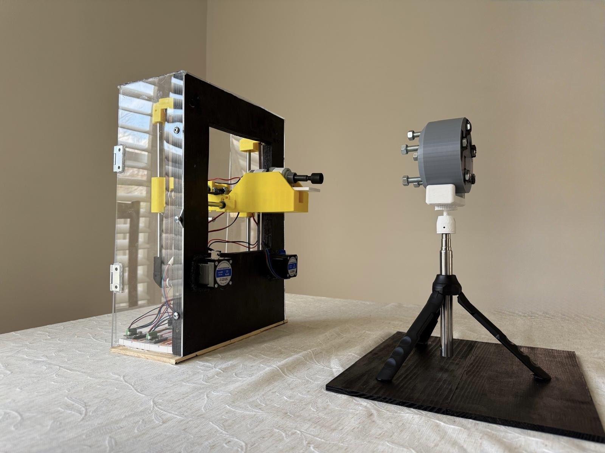
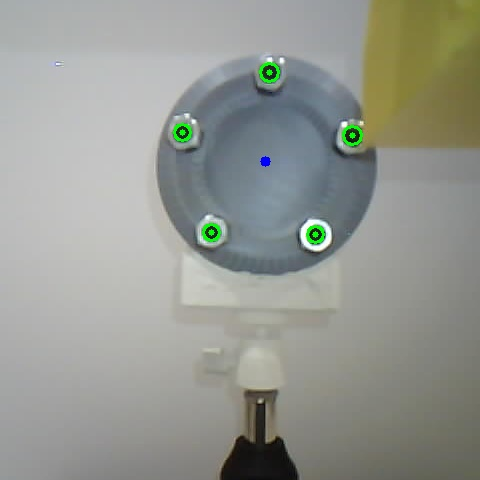
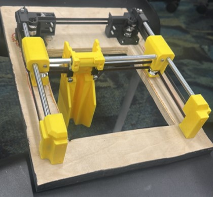
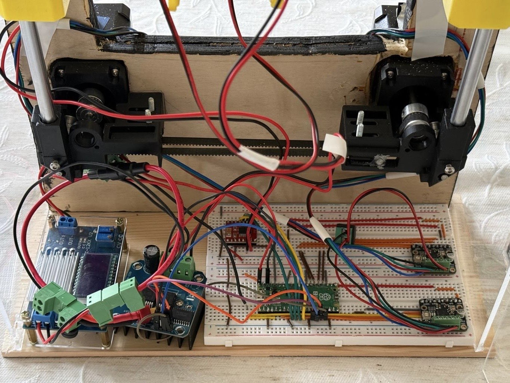
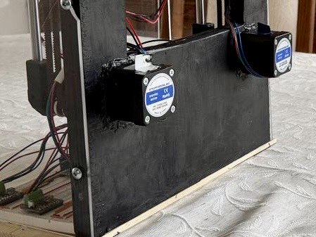
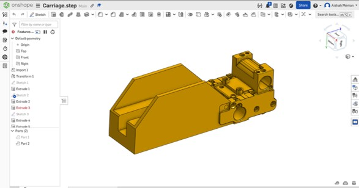
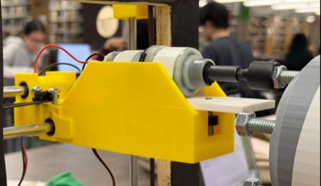

# BoltBlitz: Semi-Autonomous Lug Nut Fastening/Unfastening System

McMaster Engineering Capstone 4OI6A/B, Group S12, Sept 2025 – Apr 2026.

Vision-guided CoreXY gantry that locates lug nuts on a tire hub and drives a motorized drill to fasten/unfasten them with minimal manual intervention.

`Python` `OpenCV` `MicroPython` `Raspberry Pi 4` `Raspberry Pi Pico 2` `ESP32-CAM` `NEMA-17 Stepper Motors` `TMC2209 Stepper Motor Drivers` `TB6612FNG Motor Driver` `BTS7960 Motor Driver` `Buck-Boost Converter` `CoreXY` `Linear Actuator` `Wi-Fi/HTTP` `Onshape` `3D Printing`

<p align="center">
<br>
<em>System Fully Assembled with the CoreXY Frame, Drill Carriage, and Camera Mount with the Tire Hub.</em>
</p>

---

## Table of Contents
- [Overview](#overview)
- [Hardware & Software](#hardware--software)
- [System Architecture](#system-architecture)
- [Subsystems](#subsystems)
  - [1. Computer Vision + Detection](#1-computer-vision--detection-subsystem)
  - [2. CoreXY Mechanical](#2-corexy-mechanical-subsystem)
  - [3. CoreXY Control Logic](#3-corexy-control-logic-subsystem)
  - [4. Drill / Actuator](#4-drill--actuator-subsystem)
- [Running the System](#running-the-system)
- [System Demonstrations](#system-demonstrations)
- [Results](#results)
- [Limitations](#limitations)
- [Future Work](#future-work)
- [Full Report](#full-report)

---

## Overview

BoltBlitz is a semi-autonomous system that automates the fastening and unfastening of vehicle lug nuts. An ESP32-CAM and Raspberry Pi 4 running OpenCV detect the real-world millimeter coordinates of each lug nut on a tire hub, and those coordinates are passed to a Raspberry Pi Pico 2, which drives a CoreXY gantry (two NEMA-17 stepper motors via two TMC2209 stepper motor drivers) to position a drill-and-linear-actuator assembly directly over each bolt for fastening or unfastening. The system is split into four independently developed subsystems: computer vision, CoreXY mechanical, CoreXY control logic, and the drill/actuator, detailed below.

---

## Hardware & Software

### Hardware

| Component | Purpose |
|---|---|
| Raspberry Pi 4 | Hosts the Wi-Fi hotspot linking all devices and runs the Python/OpenCV bolt detection pipeline |
| ESP32-CAM | Captures the tire hub image used for bolt detection and streams live video for positioning |
| Raspberry Pi Pico 2 | Motion/actuation controller that converts detected coordinates into CoreXY motor commands and drives the drill/actuator sequence |
| NEMA-17 Stepper Motors (×2) | Drives the CoreXY belt/pulley system for X-Y carriage positioning |
| TMC2209 Stepper Motor Drivers (×2) | Generates STEP signals to control the NEMA-17 stepper motors |
| GT2 Timing Belt Pulleys | Translates stepper motor rotation into carriage motion along the CoreXY frame |
| LM8LUU Linear Bearings | Supports low-friction carriage translation along the linear rods |
| DC Drill Motor (repurposed IKEA power drill) | Executes the fastening/unfastening rotation on each lug nut |
| Linear Actuator | Advances/retracts the drill to engage or disengage each bolt |
| BTS7960 Motor Driver | Controls the high-current DC drill motor |
| TB6612FNG Motor Driver | Controls bidirectional movement of the linear actuator |
| 12V Rechargeable LiPo Battery | Main power source |
| Buck-Boost Converter | Steps the 12V battery supply down to a stable 6V rail for the drill/actuator drivers |
| 3D-Printed Structural Components (PLA) | CoreXY frame parts, carriage, and sliding plate, designed in Onshape |
| Plywood Base (1.5cm) | Structural base providing rigidity and portability |

### Software

| Tool / Library | Purpose |
|---|---|
| Python 3 | Bolt detection pipeline: `system_check.py`, `camera_capture.py`, `detection.py`, `main.py` |
| OpenCV (cv2) | Grayscale conversion, Gaussian blur, thresholding, contour detection, image moments |
| NumPy | Coordinates array math and pixel-to-mm conversion calculations |
| Requests | HTTP communication with the ESP32-CAM's `/control` and `/capture` endpoints |
| MicroPython | Raspberry Pi Pico 2 firmware for CoreXY motion control and drill/actuator sequencing |
| Onshape | CAD design of the CoreXY frame, carriage, and sliding plate |
| PrusaSlicer | Slicing 3D-printed structural components |
| Arduino IDE | Initial prototyping/testing of drill and actuator control logic |
| VS Code | Primary development environment for Python and MicroPython (over serial) |

---

## System Architecture

| Stage | Hardware | Output |
|---|---|---|
| Image Capture | ESP32-CAM -> Raspberry Pi 4 (Wi-Fi/HTTP) | Cropped tire hub image |
| Bolt Detection | Raspberry Pi 4 (Python/OpenCV) | `lug_coordinates.json` / `.txt` (mm coordinates) and `debug_detection.jpg` (detected bolt centers & outlines) |
| Motion Control | Raspberry Pi Pico 2 (MicroPython) -> 2× TMC2209 stepper motor drivers -> 2× NEMA-17 stepper motors | CoreXY carriage positioned at each bolt |
| Fastening/Unfastening | Pico 2 -> TB6612FNG motor driver (linear actuator) -> BTS7960 motor driver (DC drill motor) | Bolt fastened or unfastened |

Power: 12V rechargeable LiPo, stepped down by a buck-boost converter to a shared 6V rail across the drill and actuator drivers.

---

## Subsystems

### 1. Computer Vision + Detection Subsystem

**Hardware:** Raspberry Pi 4 (host, generates its own Wi-Fi hotspot), ESP32-CAM (imaging and onboard web server).

**Pipeline** (`system_check.py` -> `camera_capture.py` -> `detection.py`, all run by `main.py`):

1. **`system_check.py`**: Performs a connectivity check before anything else runs. Verifies via `nmcli`/`nmap`/`curl`:
   - Pi hotspot (`S12pi4net`) is active on `wlan0`
   - ESP32-CAM is reachable at `10.42.0.149`
   - ESP32-CAM's onboard web server returns HTTP 200
   - A third device (laptop) is present on the hotspot (host count ≥ 3)

   Any failure stops the pipeline before an image capture is attempted.

   <video src="https://github.com/user-attachments/assets/376dbaa9-75e4-477d-96ca-7aaf51f7e6c8" controls></video>
   <p align="center"><em>Demonstration of system_check.py: Confirming Hotspot, ESP32-CAM, Web Server, and Laptop Connectivity.</em></p>

2. **`camera_capture.py`**: Configures the ESP32-CAM over its `/control` HTTP endpoint (resolution UXGA 1600×1200, JPEG quality 8, LED intensity 150, auto exposure/gain/white-balance enabled), prints the live-stream URL for manual tire-hub positioning, then when user presses ENTER pulls a still frame from `/capture`, decodes it with OpenCV, and crops it to the center 60%×80% of the frame (`CROP_X 0.20–0.80`, `CROP_Y 0.10–0.90`). Saves the photo taken as `latest_capture.jpg`.

   <video src="https://github.com/user-attachments/assets/d76f85b7-5c18-4564-a833-d9e7e13e0686" controls></video>
   <p align="center"><em>Demonstration of camera_capture.py: Starts Live Stream, Positioning done by User, and Still-Image Captured from the ESP32-CAM.</em></p>

3. **`detection.py`**: The actual bolt detection logic:
   - Grayscale: 7×7 Gaussian blur
   - Inverted binary threshold at pixel value **100** to isolate the black painted bolt faces from the reflective hub.
   - 3×3 noise removal (2 iterations)
   - `cv2.findContours` on the thresholded mask, filtered by:
     - Area: **80–3000 px²**
     - Circularity `4π·area/perimeter²` ≥ **0.6**
     - Estimated radius: **4–40 px**
   - Bolt center computed from image moments (`m10/m00`, `m01/m00`).
   - Duplicate detections are merged if two centers are closer than the larger of their two radii.
   - Pixel to mm conversion via a scale factor `pixels_per_mm = avg_bolt_diameter_px / 5.0mm` (known physical bolt diameter), with the origin set to the average of all detected bolt centers (positive X = right, positive Y = up).
   - Outputs: `lug_coordinates.json` (pixel & mm pairs), `lug_coordinates.txt` (mm coordinates ×100, integer, one bolt per line, used by the Pico 2), and `debug_detection.jpg`, a debug image showing the detected center point and outer perimeter of each bolt, alongside the computed origin.
   
     <p align="center">
       <br>
       <em>Green Circles Mark each Detected Bolt's Outer Perimeter, Green Dots mark the Detected Center of each bolt, and the Blue Dot marks the Computed Origin (Average of all Bolt Centers).</em>
     </p>
     
     <video src="https://github.com/user-attachments/assets/9e853fc7-a148-4d6d-bf81-0cb927b02b10" controls></video>
     <p align="center"><em>Demonstration of detection.py: Bolt Detection running on a Captured Tire Hub Image, producing the Debug Overlay and Coordinate Output.</em></p>

   Detection parameters (threshold value, circularity, brightness) were tuned experimentally. See [Results](#results).

### 2. CoreXY Mechanical Subsystem

- Two NEMA-17 stepper motors driving GT2 timing belt pulleys (2mm pitch, 6mm width).
- Linear motion on 250mm solid rods (frame sides) and 200mm hollow rods (center, weight reduction), supported by LM8LUU linear bearings.
- CoreXY was chosen over a standard XY gantry for its lower moving mass and higher achievable speed, since both motors drive combined X and Y motion simultaneously rather than one motor per axis.
- Structure modeled in Onshape, 3D-printed in PLA (Thode Makerspace), mounted to a 1.5cm plywood base for rigidity/portability.
- Belt retainers clamp the belt to the carriage for a fixed belt-to-carriage connection. Belt tension was found to be critical for the vertical orientation (counteracts gravity-induced drift/slip).

<p align="center">
  <br>
  <em>Assembled CoreXY Frame with Belt/Pulley System and Drill Carriage Mounted.</em>
</p>

### 3. CoreXY Control Logic Subsystem

- **Controller:** Raspberry Pi Pico 2, programmed in MicroPython (developed in VS Code over serial).
- **Drivers:** Two Adafruit TMC2209 stepper motor drivers (STEP interface) driving the two NEMA-17 stepper motors.
- **Power:** AC to DC supply feeding both TMC2209 stepper motor drivers.
- **Logic Flow:** Reads the mm coordinate text file produced by `detection.py`, converts each target to relative/absolute displacement from home, and since the CoreXY axes are coupled, commands both NEMA-17 stepper motors simultaneously. The Pico 2 generates synchronized STEP signals for both TMC2209 stepper motor drivers, and the carriage moves through each coordinate in a "star" sequence (mirroring a manual lug-nut fastening order).
- Motion parameters (mm/step conversion, speed, acceleration) were iteratively tuned against the vertically mounted CoreXY frame, which was the main limiter on achievable speed/smoothness (see [Limitations](#limitations)).

<p align="center">
  
  
</p>
<p align="center"><em>CoreXY Control Logic Breadboard Circuit and NEMA 17 Stepper Motors.</em></p>

### 4. Drill / Actuator Subsystem

- **Drive Motor:** DC motor repurposed from an IKEA power drill, chosen for torque and compact form factor, mounted on a 3D-printed sliding plate and carriage.
- **Linear Actuator:** Provides about 1 inch of Z-direction travel to engage/disengage the drill from the lug nut, extending to engage the bit and retracting slightly during fastening/unfastening to preserve alignment and avoid thread damage.
- **Drivers:** BTS7960 motor driver (high-current DC drill motor, handles torque-intensive load) and TB6612FNG motor driver (bidirectional linear actuator control).
- **Control:** Both the BTS7960 and TB6612FNG motor drivers are commanded by the same Raspberry Pi Pico 2 used for the CoreXY motion, synchronizing engagement, rotation, and disengagement.
- **Power:** Shared 12V LiPo, stepped down by a buck-boost converter to a 6V rail.
- CAD for the carriage/sliding-plate assembly was done in Onshape, fabricated via PrusaSlicer and 3D printing. Control logic was initially prototyped in Arduino IDE before final MicroPython integration.

<p align="center">
  
  
</p>
<p align="center"><em>CAD Design of Carriage in OnShape, and 3D-Printed Carriage with the Repurposed Drill Motor, Sliding Plate, and Linear Actuator.</em></p>

---

## Running the System

Run from the Raspberry Pi 4 with the Pi's hotspot active and the ESP32-CAM powered on:

```bash
python3 main.py
```

This runs the full vision pipeline end-to-end: `system_check.py` -> `camera_capture.py` -> `detection.py`. Any stage failing stops the run before the next stage starts. Each script can also be run standalone for debugging:

```bash
python3 system_check.py     # verify hotspot/ESP32-CAM/laptop connectivity
python3 camera_capture.py   # capture and crop tire hub image, save to latest_capture.jpg
python3 detection.py        # run detection on the latest capture, output coordinates and debug image
```

Successful completion produces `lug_coordinates.json`, `lug_coordinates.txt`, and `debug_detection.jpg`, at which point `lug_coordinates.txt` is picked up by the Pico 2 firmware for CoreXY motion.

---

## System Demonstrations

<video src="https://github.com/user-attachments/assets/ca87239c-2418-439b-8eec-c9776f859a82" controls></video>
<p align="center"><em>Demonstration of main.py from the Computer Vision + Detection Subsystem: rRunning system_check -> camera_capture -> detection.</em></p>

<video src="https://github.com/user-attachments/assets/794cd37d-d199-41a5-8a0e-480fa2d8a67d" controls></video>
<p align="center"><em>Demonstration of CoreXY Carriage moving to Each Detected Bolt Coordinate and the Drill Engaging/Disengaging to Fasten and Unfasten the Lug Nuts.</em></p>

---

## Results

- **Bolt Detection:** Reliable once bolt surfaces were painted matte black. Optimal LED brightness of 150/255, threshold value 100, and circularity ≥ 0.6 were the tuned values for detecting all bolts without noise.
- **CoreXY Positioning:** High repeatability at a stable **~6 mm/s**. Diagonal motion caused vibration at higher speeds, resolved by reducing speed and tensioning belts.
- **Drill/Actuator:** Consistently engaged, rotated, and disengaged across multiple cycles.
- **End-to-End:** Full pipeline executed successfully with minimal manual intervention between stages.

---

## Limitations

- Vertical CoreXY orientation meant gravity opposed motion in certain directions, limiting the usable speed and requiring tighter belt tension.
- Camera-to-hub distance had to stay fixed, since too much variation degraded coordinate accuracy.
- Manual homing between stages (no limit switches yet) introduces some run-to-run positioning error.
- Component selection was cost-constrained relative to industrial equipment, trading off speed/durability for affordability.

---

## Future Work

- Real-time communication between vision and motion controllers to remove manual hand-off between stages.
- Limit switches and stored home position for absolute positioning.
- Higher-torque motors or counterbalancing to offset gravity drag.
- Custom PCB to replace breadboard wiring.
- Refined calibration for tighter coordinate accuracy.

---

## Full Report
 
[Read the Full Capstone Report](Files/Capstone_Final_Report.pdf)
